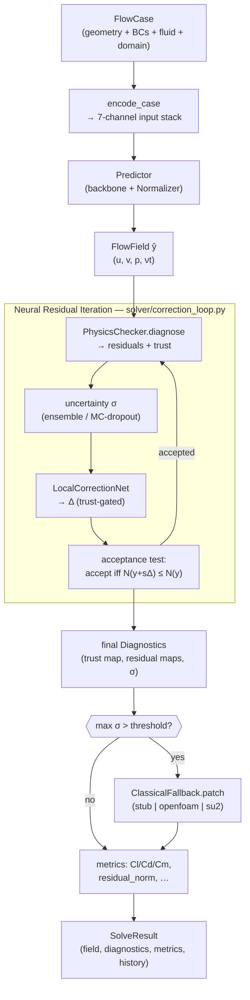

# NeuroForge CFD — Architecture

Engineer-facing companion to the [README](../README.md), the
[research paper draft](paper/neuroforge_cfd.md), and the [roadmap](ROADMAP.md).
This document describes the module map, the frozen data contracts, the I/O channel
spec, the `solve()` control flow, the extension points, and the threading note.

The authoritative interface contract is [`CONVENTIONS.md`](../CONVENTIONS.md) plus
the three frozen files `core/types.py`, `core/config.py`, and `models/base.py`.

---

## 1. System overview



ASCII view of the same pipeline:

```
FlowCase ─▶ encode_case ─▶ Predictor ─▶ ŷ ─┐
                                            ▼
                       ┌───── Neural Residual Iteration ─────┐
                       │ diagnose → uncertainty → correct →  │
                       │ acceptance test (residual monotone) │◀─ loop until tol / stall / max_iters
                       └──────────────────┬──────────────────┘
                                          ▼
                       final Diagnostics (trust + residual + σ)
                                          ▼
                       uncertainty-gated ClassicalFallback (if max σ > thr)
                                          ▼
                       metrics + SolveResult
```

---

## 2. Module map

| Package | Responsibility | Imports torch? |
|---|---|---|
| `core/` | Frozen contracts: `FlowCase`, `FlowField`, `Diagnostics`, `SolveResult`, `Domain`, `Geometry`, `Config`. Single source of truth for shapes/channels. | No (NumPy only) |
| `geometry/` | NACA airfoils + `.dat`/STL/OBJ loaders, `signed_distance`, `solid_mask`, `surface_normals`, `encode_case` (builds the 7-channel input). | No |
| `data/` | `SyntheticRANS` generator, `load_airfrans`, `rasterize_point_cloud`, `Normalizer`, `FlowDataset`, `build_dataloaders`. | Dataset/loader: yes |
| `models/` | `FNO2d`, `GeoFNO`, `PhysicsTransformer`, `UNet`, `DeepONet`, `LocalCorrectionNet`, `DeepEnsemble`, `MCDropoutUQ`; string-keyed registry. | Yes |
| `physics/` | `ddx/ddy/laplacian/divergence/gradient`, `continuity_residual`, `momentum_residual`, `bc_violation`, `PhysicsChecker`, `trust_map`, metrics, `physics_residual_torch`. | Operators are dual numpy/torch; `physics_residual_torch` is torch-only |
| `solver/` | `Predictor`, `NeuroForgeEngine`, `neural_residual_iteration`, `ClassicalFallback`. | Yes |
| `train/` | `CompositeLoss`, `Trainer` (backbone + corrector), checkpoint format. | Yes |
| `viz/`, `cli.py`, `app/` | Plots, HTML report, `neuroforge` CLI, Streamlit UI. | Lazy/optional |

Dependency direction: `core` ← everything; `geometry/data/physics/models` are
mutually independent; `solver/train` compose them; `viz/cli/app` sit on top.
Optional dependencies (`airfrans`, `pyvista`, `streamlit`, `plotly`) are imported
lazily inside the function that needs them.

---

## 3. Data contracts (frozen)

All structured fields are `(ny, nx)` `float32`; network tensors are channel-first
`(B, C, ny, nx)`. See `core/types.py`.

**`FlowCase`** — the problem statement.

| Field | Type | Meaning |
|---|---|---|
| `geometry` | `Geometry` | Ordered CCW surface loop `(N,2)` + optional normals |
| `bc` | `BoundaryConditions` | `u_inf`, `aoa_deg`, `reynolds`; `inlet_vector() → (u,v)` |
| `fluid` | `FluidProperties` | `density`, `kinematic_viscosity` (ν) |
| `domain` | `Domain` | `bounds`, `nx`, `ny`; `dx`, `dy`, `grid()` |
| `name` | `str` | Case label |

`FlowCase.from_airfoil(...)` builds a NACA case and fixes
ν = `u_inf * chord / Re` for a consistent non-dimensional state.

**`FlowField`** — the solution on the grid.

| Field | Shape | Meaning |
|---|---|---|
| `u, v, p` | `(ny,nx)` | Velocity components + **kinematic** pressure (p/ρ) |
| `nut` | `(ny,nx)` | Turbulent eddy viscosity ν_t (defaults to zeros) |
| `mask` | `(ny,nx)` | 1 in fluid, 0 in solid |
| `sdf` | `(ny,nx)` | Signed distance, **negative inside** the body |

Helpers: `speed()`, `as_array() → (4,ny,nx)`, `from_array(...)`, `save/load` (npz).

**`Diagnostics`** — the self-assessment (output of `PhysicsChecker.diagnose`).

| Field | Meaning |
|---|---|
| `continuity`, `momentum_x`, `momentum_y` | Residual maps `(ny,nx)`, zeroed in solid |
| `bc_violation` | No-slip + far-field mismatch map |
| `uncertainty` | Per-cell σ (zeros if no UQ estimator) |
| `trust` | `[0,1]` reliability (1 = trustworthy) |
| `trust_class` | `{0 red, 1 yellow, 2 green}` |
| `summary` | Scalar means/maxes + trust-class fractions |
| `residual_norm()` | RMS of √(r_c² + r_x² + r_y²) — the convergence scalar |

**`SolveResult`** — the engine output: `case`, `field`, `diagnostics`,
`metrics` (`cl/cd/cm`, `residual_norm`, `n_iters`, speed/pressure summary),
`history` (per-iteration list), `meta`. `save_report(path)` writes the HTML
report; `summary()` returns the scalar metrics dict.

---

## 4. The I/O channel spec (the contract that makes backbones interchangeable)

```
INPUT_CHANNELS  (N_IN  = 7):  (sdf, mask, x, y, u_in, v_in, log_re)
OUTPUT_CHANNELS (N_OUT = 4):  (u, v, p, nut)
```

- Built by `geometry.encode.encode_case(case) → (7, ny, nx)`: signed distance,
  solid mask, normalised coordinates (~[-1,1]), the freestream vector broadcast
  over the grid, and `log10(Re)`.
- `p` is **kinematic** (p/ρ). Physics residuals operate on **physical
  (denormalised)** fields with `nu_eff = nu_laminar + nut`.
- Every backbone is `forward(x:(B,7,H,W)) → (B,4,H,W)`; the `Normalizer`
  standardises input and output channels separately and is saved in the
  checkpoint.

---

## 5. `solve()` control flow

`NeuroForgeEngine.solve(case, max_iters=None)` (in `solver/engine.py`):

1. **Predict.** `Predictor.predict(case)` → `encode_case` → normalise input →
   backbone forward → denormalise output → `FlowField ŷ` (mask/sdf taken from the
   encoded geometry channels).
2. **Neural Residual Iteration.** `neural_residual_iteration(ŷ, case, checker,
   corrector, corr_cfg, predictor, uq)` → `(field, history)`.
3. **Final diagnostics.** Re-diagnose (capturing uncertainty if a UQ estimator is
   attached).
4. **Uncertainty-gated fallback.** If `fallback_enabled` and `max(σ) >
   fallback_uncertainty_threshold`, build the region `trust < 0.5 ∧ fluid` and
   call `ClassicalFallback(backend).patch(...)`.
5. **Metrics.** Force coefficients (`Cl/Cd/Cm` via surface integration), residual
   norm, iteration count, speed/pressure/trust summaries.
6. Return `SolveResult`.

### 5.1 `neural_residual_iteration` — pseudo-code

```text
diag      ← checker.diagnose(field, case, uncertainty = σ(case) or None)
cur_norm  ← diag.residual_norm()
history   ← [ {iter:0, residual_norm:cur_norm, max_uncertainty, trust_mean} ]
if corrector is None: return field, history          # diagnose-only path

solid ← (mask ≤ 0.5)
for it in 1 .. cfg.max_iters:
    if cur_norm < cfg.residual_tol: break

    # build corrector inputs in NORMALISED space
    field_n  ← normalizer.norm_out(field)
    resid_n  ← physics_residual_torch(field, encode_case(case)) , std-normalised  # (1,3,H,W)
    geom_n   ← normalizer.norm_in(encode_case(case))
    Δ_norm   ← corrector(field=field_n, residual=resid_n, geom=geom_n)            # no_grad

    # denormalise the additive delta (affine mean cancels → scale by std_out only)
    Δ        ← Δ_norm * std_out
    if cfg.gate_by_trust: Δ ← Δ * (1 - diag.trust)    # act mostly where untrusted
    Δ[solid] ← 0                                       # never touch the solid

    # backtracking acceptance test  →  guarantees monotone residual
    step ← cfg.step_size ; accepted ← false
    for bt in 0 .. 4:
        cand      ← field + step * Δ
        cand_diag ← checker.diagnose(cand, case, uncertainty = σ or None)
        if isfinite(cand_diag.residual_norm()) and
           cand_diag.residual_norm() ≤ cur_norm + ε:
            accepted ← true ; break
        step ← step / 2
    if not accepted: break                             # no safe step → stop

    rel_improve ← (cur_norm - cand_norm) / cur_norm
    field, diag, cur_norm ← cand, cand_diag, cand_norm
    append history entry
    if rel_improve < cfg.min_improvement: break        # stalled → stop

return field, history
```

**Invariant.** Because a candidate is committed only when its residual norm does
not exceed the current one, `history[k].residual_norm` is **non-increasing in
`k`**. This is asserted by the end-to-end test. The loop terminates on the
residual tolerance, a stalled relative improvement, an unaccepted step, or the
iteration cap.

---

## 6. Extension points

### 6.1 Add a backbone via the registry

```python
# src/neuroforge/models/my_backbone.py
from __future__ import annotations
import torch
from neuroforge.core.types import N_IN, N_OUT
from neuroforge.models.base import NeuralSolver, register_model

@register_model("my_backbone")
class MyBackbone(NeuralSolver):
    def __init__(self, in_channels=N_IN, out_channels=N_OUT, width=32, n_layers=4, **hp):
        super().__init__(in_channels=in_channels, out_channels=out_channels)
        ...  # build layers

    def forward(self, x: torch.Tensor) -> torch.Tensor:  # (B,7,H,W) -> (B,4,H,W)
        ...
```

Then `build_model("my_backbone", width=..., n_layers=...)` instantiates it,
`available_models()` lists it, and it flows through `Trainer`, `Predictor`, the
engine, and the benchmark harness unchanged — no other file needs editing. Keep
it device-agnostic (no hard-coded `.cuda()`) and CPU-runnable, with `dropout` if
you want MC-dropout UQ to work.

### 6.2 Add a classical fallback backend

Extend `solver/fallback.py`'s `ClassicalFallback`:

- add the backend name to `_SUPPORTED`;
- implement the branch in `patch(field, case, region_mask)`: extract the flagged
  sub-region, run the local solve (initialised from the engine prediction), and
  blend the patched values back over the trust gradient, returning a new
  `FlowField` with `meta['fallback']` populated;
- keep the import lazy and guard with a clear error if the external solver is
  absent (the module must import with nothing installed). The `stub` backend is
  the reference no-op that documents the intended contract.

Enable it via `CorrectionConfig.fallback_enabled = True`,
`fallback_solver = "<name>"`, and `fallback_uncertainty_threshold`.

### 6.3 Add / swap an uncertainty estimator

Any object exposing `predict_with_uncertainty(x) → (mean, std)` over
`(B,4,H,W)` works. `DeepEnsemble(members)` and `MCDropoutUQ(model)` are provided;
pass one as `NeuroForgeEngine(..., uq=estimator)` and its channel-mean std becomes
the per-cell σ feeding the trust map.

### 6.4 Checkpoint format

`Trainer.save` writes a dict consumed by `NeuroForgeEngine.from_checkpoint`:
`{"model_state", "model_config" (ModelConfig asdict), "normalizer" (state_dict),
"nu", "neuroforge_version"}` plus optional `"corrector_state"` /
`"corrector_config"`.

---

## 7. Threading note (why BLAS/OMP/MKL are capped)

On import, `neuroforge/__init__.py` runs **before** numpy/torch are imported and
sets, via `os.environ.setdefault`, `OPENBLAS_NUM_THREADS = OMP_NUM_THREADS =
MKL_NUM_THREADS = 1` (and best-effort `threadpoolctl` / `torch.set_num_threads(1)`
if those libraries are already loaded). Prebuilt numpy/torch wheels ship
OpenBLAS/MKL with a high `MAX_THREADS` and dynamic architecture dispatch, which
**oversubscribes catastrophically on low-core machines** (laptops, VMs, CI):

- the synthetic generator's ~200×200 `np.linalg.solve` (source-panel system) can
  take **> 20 s instead of ~1 ms**;
- a 32×32 FFT inside the FNO can take **~0.15 s instead of ~0.3 ms**, making a
  training step ~30× slower.

Both collapse to instant with a single math-library thread, and the small dense
solves / FFTs here do not benefit from BLAS/FFT threading on CPU anyway (torch
already parallelises across the batch at the op level). `setdefault` means a power
user training a large model on a many-core CPU can override any of these (e.g.
`OMP_NUM_THREADS=8`) *before* importing `neuroforge`.

---

## 8. Cross-references

- Product pitch, quickstart, and architecture diagram: [`README.md`](../README.md)
- Interface contract (frozen signatures, conventions): [`CONVENTIONS.md`](../CONVENTIONS.md)
- Method, related work, experimental protocol: [`paper/neuroforge_cfd.md`](paper/neuroforge_cfd.md)
- Staged plan and non-goals: [`ROADMAP.md`](ROADMAP.md)
